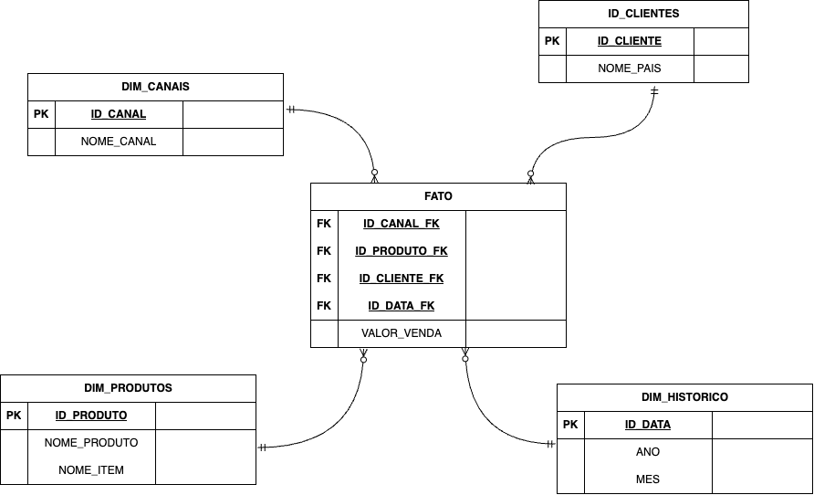

# Physical Data Model (MySQL)

This project serves as a practical demonstration of my learning journey with MySQL databases. It utilizes a MySQL database server set up on a Red Hat Enterprise Linux 9 (RHEL 9) virtual machine (VM). The initial purpose is to implement the model below:



# Technologies and Tools

* MySQL Server
* Linux (RHEL9)
* Oracle SQL Developer
* Drawio
* SFTP/FTP Protocol

# Project Structure

Here's the used structure for this project:

```
physical-data-model-mysql/
├── database          
│   ├── data
|   |   ├── fato.txt
|   ├── 01 - create_tablespace.sql (Creating tablespace)
|   ├── 02 - create_tables.sql     (Creating Tables, schemas and partitions)
|   ├── 03 - load_data.sql         (Loading data from data/fato.txt - inside the server - to table)
├── README.md
```

# Purpouse

This project provides a hands-on experience with key aspects of MySQL database management, including:

* Setting up a basic MySQL database structure (schema)
* Setting up a VM able to be used by external users in the same Network
* Management acess and permission to interact with the database 
* Writing SQL queries to interact with the database


# Additional notes

* The `database` folder contains various SQL scripts that demonstrate different functionalities and example of the used data. These scripts can be executed once you connect to the MySQL server on your VM. 

* You'll need to have a separate setup process for the VM and database (not included in this project) to connect and run the scripts. 

* This project serves as a learning tool for personal development.
